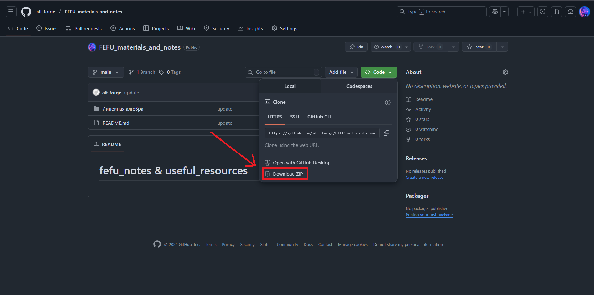
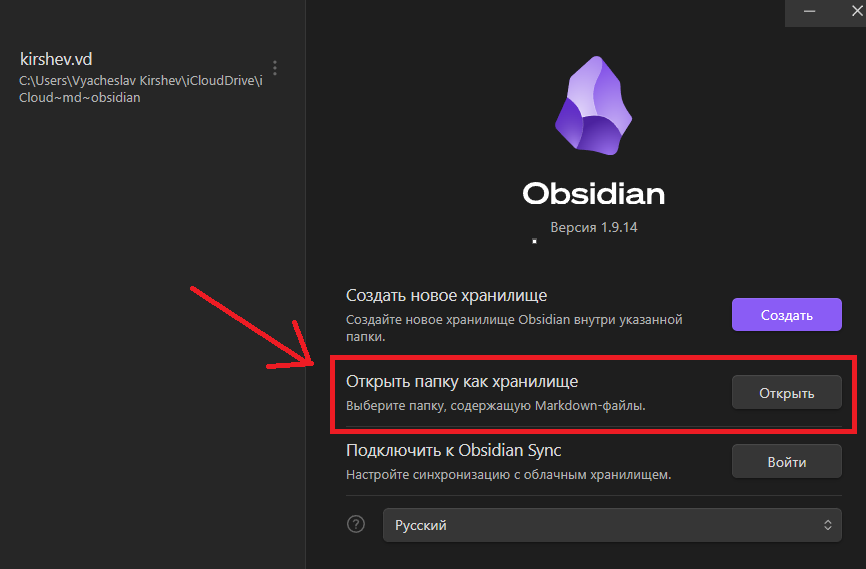

# Obsidian и с чем его едят?
**Obsidian** — это мощный инструмент для ведения заметок в формате Markdown (да-да, тот самый .md)  
Он позволяет удобно хранить, связывать и визуализировать конспекты как сеть знаний — идеально подходит для лекций, идей и личных баз знаний.

**Где скачать?** - https://obsidian.md

**Как пользоваться данной базой данных?**:
Для начала вам необходимо скачать zip-архив с репозиторием.

Распакуйте его в удобную для вас папку (позже эту папку, конечно можно поменять, но придётся переносить хранилище в obsidian)

После распаковки, откройте obsidian и откройте эту папку как хранилище.

Готово! У вас есть готовое рабочее пространство.

**Ликбез по плагинам**:
# Структура проекта
- `/lectures` — лекции
- `/labs` — лабораторные
- `/tasks` — практические задачи
- `/resources` — внешние источники, книги, ссылки

# Доп. Программы и Сайты
## Сайты:
`https://www.onlinegdb.com/` - Онлайн компилятор  
`https://programforyou.ru/block-diagram-redactor` - Создание блок-схем  
`https://ru.wikibooks.org/wiki/LaTeX` - LaTeX документация
	
## Программы:
`https://ru.windjvu.com/` - программа для чтения учебников в формате .djvu

# Контакты и прочее
При необходимости, по любым вопросам писать на почту yan.kirsh@yandex.ru. Любые материалы и предложения, дополняющие репозиторий, приветствуются.